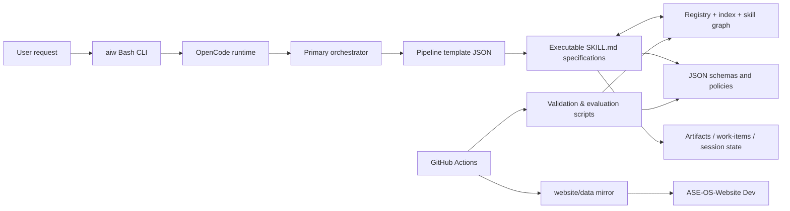
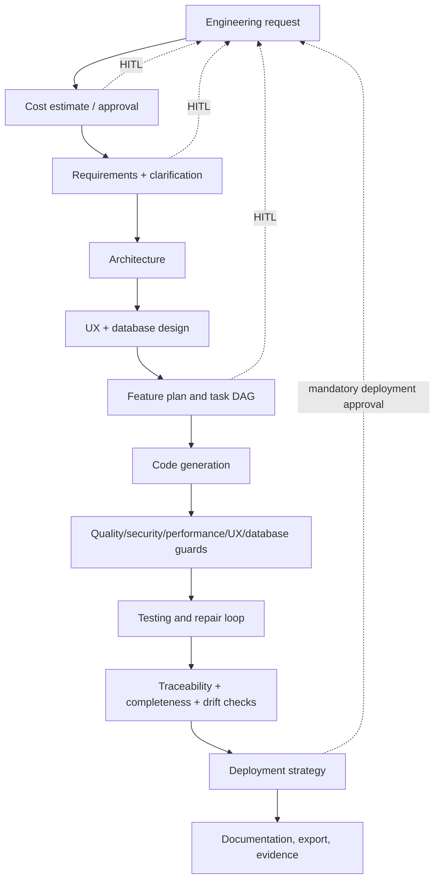
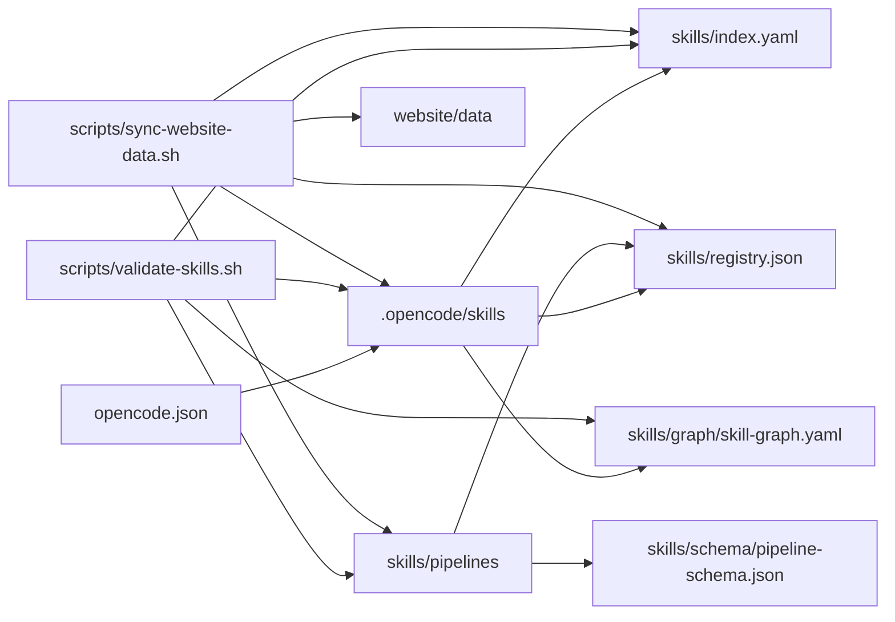

# AI Workflow — Project Context

> **Purpose.** This is the primary starting point for developers and AI agents working in this repository. It records facts verified from the working tree and GitHub on **2026-09-22**, distinguishes findings from recommendations, and avoids recording credentials.

## 1. Executive overview

**AI Workflow** is a public, file-based framework for running AI-assisted engineering workflows over an existing codebase. It is not itself a deployed end-user application or a backend service. Its product is a versioned library of agent instructions (“skills”), routing/pipeline specifications, policy/schema contracts, command-line automation, evaluations, and governance controls.

The intended business outcome is to take engineering work from an idea through requirements, architecture, planning, implementation, review, tests, and deployment planning while preserving structured evidence and requiring human approval at consequential gates. It can run linked to another local project (`aiw start <path>`) or copy its runtime material into that project (`aiw init <path>`).

### What is implemented

- A Bash CLI, `aiw`, dispatches setup, health, validation, onboarding, evaluation, maintenance, graph, and website-data synchronization commands.
- OpenCode configuration in `opencode.json` defines a primary orchestrator and specialized subagents, their model assignments, permissions, and MCP integration configuration.
- `.opencode/skills/*/SKILL.md` contains executable skill specifications; `skills/index.yaml`, `skills/registry.json`, and `skills/graph/skill-graph.yaml` describe and cross-reference them.
- `skills/pipelines/*.json` supplies 22 pipeline templates, including a full idea-to-production flow, review, deployment, compliance, and domain-specific variants.
- Python/Bash/Node scripts validate contracts and registries; evaluate quick review, traceability, quality, context preservation, onboarding, security, supply chain, operational evidence, and model compatibility; and synchronize generated website data.
- A layered onboarding implementation (O0–O7) supports runtime-neutral, increasingly controlled local setup, installation verification, digest-bound execution, offline attestation, and verifier-adapter checks.

### Important boundary

Most “execution” logic in the framework is declarative prompt/configuration logic, not a server process that independently invokes models. The agent runtime (currently OpenCode configuration) interprets the skill and pipeline instructions. Several deployment documents describe a target application’s ideal promotion process; they are **guidance/templates**, not proof that this repository deploys an application through dev/staging/pre-production/production.

## 2. Technology and repository profile

| Area | Actual implementation |
|---|---|
| Main interface | Bash CLI: [`aiw`](aiw) |
| Runtime integration | OpenCode configuration: [`opencode.json`](opencode.json); OpenCode skill and agent Markdown under `.opencode/` |
| Validation/runtime utilities | Bash, Python 3, Node.js 20+; AJV / `ajv-formats` are development dependencies |
| Configuration/data formats | JSON Schema draft-07, JSON, YAML, Markdown |
| Package metadata | [`package.json`](package.json), lockfile, `requirements-dev.txt` |
| Automated checks | GitHub Actions, local `aiw validate`, specialized Python scripts |
| External services | Optional GitHub, Brave Search, Context7; disabled Slack, Vercel, and Fetch MCP integrations; GitHub Actions also synchronizes data to `Albadry-Esmat/ASE-OS-Website` |
| Data persistence | Filesystem artifacts/configuration/work items; no application database or ORM is present |
| Website | This repository owns a generated `website/data/` mirror, not the website source; the companion repository is ASE-OS-Website |

The root package is private (`"private": true`) despite the GitHub repository being public. The repository is MIT licensed (verified from GitHub API); confirm the tracked `LICENSE` file when working from an alternate checkout because it was not part of the root file inventory at analysis time.

## 3. Architecture and execution flow

### High-level architecture (verified intent and files)

The authoritative source for skill discovery is documented as `skills/registry.json`; the index and YAML graph are compatibility/validation partners. A change to a skill normally needs coordinated updates across the executable `SKILL.md`, index, registry, graph, docs/changelog, and generated website data.

### Full-pipeline flow

The actual source pipeline is [`skills/pipelines/full-pipeline.json`](skills/pipelines/full-pipeline.json). Its currently modified local version identifies itself as 4.0.0 and includes cost estimation, requirement analysis/clarification, optional debates/research, architecture and UX/database design, planning, task DAG/impact analysis, optional specialized reviews and confidence/debate/aggregation/contract-validation work, implementation, guard/test/traceability/completeness/drift/defect flows, deployment planning, documentation/export, and post-run cost reporting.

This diagram represents pipeline specification intent. It does **not** prove a model invocation engine or real deployment executor is implemented in this repository.

### Core module responsibilities

| Module | Responsibility |
|---|---|
| [`aiw`](aiw) | Stable command dispatcher; resolves repository root, selects Python/validator, invokes scripts and OpenCode. |
| [`opencode.json`](opencode.json) | Runtime/MCP configuration and 19 agent definitions (primary plus 18 specialists). |
| [`.opencode/agent/`](.opencode/agent) | Agent behavior and constraints. |
| [`.opencode/skills/`](.opencode/skills) | Executable skill contracts. Orchestrator is `.opencode/skills/orchestrator/SKILL.md`. |
| [`skills/pipelines/`](skills/pipelines) | Pipeline routing/configuration contracts. |
| [`skills/index.yaml`](skills/index.yaml), [`skills/registry.json`](skills/registry.json), [`skills/graph/skill-graph.yaml`](skills/graph/skill-graph.yaml) | Skill metadata, discovery, dependency graph, versions, and validation targets. |
| [`skills/schema/`](skills/schema) and [`config/`](config) | Schemas, policies, execution contracts, capability/toolchain/runtime catalogs, and controlled fixtures. |
| [`scripts/`](scripts) | Operational behavior: setup, checks, validation, migration-like onboarding state, evaluation, scans, mirroring, maintenance. |
| [`evals/`](evals) | Fixture-driven evaluation corpus; quick-review, traceability, context preservation, autonomy, feedback, and onboarding tests. |
| [`docs/`](docs) | Product/architecture/governance/reference documentation and ADRs. |
| [`website/data/`](website/data) | Generated/mirrored data consumed by the separate website repository. |
| [`work-items/`](work-items) and [`artifacts/`](artifacts) | Runtime/project outputs; most generated content is intentionally ignored by Git. |

## 4. Domain logic and data relationships

The central domain is **governed work execution**, not business entities such as customers or orders. The canonical models are requirements, architecture/ADRs, feature plans/tasks, execution steps, gate decisions, policy decisions, artifacts, work items, and evidence.

### Key rules and effects

- Skills are intended to be stateless and exchange structured outputs validated by schemas. The orchestrator is expected to retry failed validation and route feedback to earlier skills.
- HITL decisions protect scope, architecture/planning, security/completeness, and deployment. `full-pipeline.json` contains the exact gates; do not rely on older prose diagrams when changing gate behavior.
- The work lifecycle layer tracks bugs, change requests, tasks, and companion work items; exports are one-way outbound and should be PII-scrubbed. See [`docs/work-item-foundation.md`](docs/work-item-foundation.md), contracts, and relevant skills before modifying state transitions.
- The O2–O7 onboarding flow applies a security model: detect/select a runtime deterministically; do not silently fall back; keep raw credentials with providers/adapters; use explicit approval and evidence for target-project mutation, installation, local execution, attestation, and verifier refresh.
- Website data is an exact mirror workflow. `scripts/sync-website-data.sh`, `scripts/data-integrity.py`, release manifests, and `.github/workflows/sync-website.yml` couple source changes to the companion site.

### Important cross-module dependency map

## 5. Repository and GitHub analysis

### Verified repository setup

| Property | Value |
|---|---|
| GitHub repository | `Albadry-Esmat/AI-Workflow` (public, not archived) |
| Remote | `origin` fetch/push: `https://github.com/Albadry-Esmat/AI-Workflow.git` |
| Default branch | `main` (confirmed by `git ls-remote --symref` and GitHub API) |
| Current local branch | `Dev` (local working branch; its remote `origin/Dev` was removed after migration) |
| Local `main` | tracks `origin/main` |
| Current HEAD at analysis | `24a7894` — “fix: warn instead of fail when .opencode/node_modules is missing” (2026-09-13) |
| Remote main at analysis | `d8dd32f` — merge Dev into main (2026-09-13) |
| Tags/releases | No Git tags were found locally. Release artifacts/tags: **Unknown / Needs Verification**. |

As of 2026-09-22, GitHub has one remote branch (`main`) and no open pull requests. On 2026-09-22, the diverged `release/production-hardening` and `fix/production-hardening-reconciled` branches were archived as the dated tags `archive/release-production-hardening-2026-09-22` and `archive/fix-production-hardening-reconciled-2026-09-22`, then deleted from GitHub. Dependabot PRs for setup-node (#14), setup-python (#17), and checkout (#20, replacing superseded #13) were merged; obsolete branches were deleted. Stale local remote-tracking refs were pruned during the same cleanup. `main` is protected against force-pushes and deletion, requires one approving review, requires conversation resolution, and requires the `Scan repository history for secrets` check.

### Branch and merge conventions (observed)

- Documentation says framework changes target `main`; personal project material belongs on `develop` or a fork.
- Actual active development had been `Dev` (capital D); the remote branch was retired during cleanup and `main` is now the sole canonical branch. Website synchronization is triggered from `main`.
- Historical PR prefixes include `feature/`, `security/`, `fix/`, `docs/`, `release/`, and Dependabot conventions. `main` is protected against force-push and deletion, requires one approval plus conversation resolution, and requires the secret-scan status check.
- The recent history is dominated by onboarding, production hardening, governance, validation, and synchronization. PRs #6–#12 were merged in late August; PR #15 merged documentation/metadata; dependency PRs are open/closed as listed above.

### Hygiene and sensitive material

`.gitignore` excludes `.env`/`.env.*`, build output, graph output, runtime state, exports, work-item content, backups, caches, and evaluation reports. A tracked controlled public-key fixture exists at `config/attestations/o6/controlled-fixture-public.pem`; it is named and used as a public fixture, not reported as a secret. No tracked private-key-style or `.env` file was found by filename scan. Do not treat that filename check as a complete secret scan.

The working tree was already dirty before this document was added: changes to four skill/pipeline registry files and multiple untracked skills/pipeline/schema documents existed. They are user work; they were not altered by this analysis.

## 6. Development workflow

### Existing workflow (verified)

1. Clone, then run `./aiw setup` (or `make setup`). Setup may create `.env`, local directories, a Python environment/dependencies, and a pre-commit hook; it is a mutation and should not be run casually in another checkout.
2. Use `aiw health`, `aiw doctor`, `aiw validate`, and applicable focused validation commands. Requirements include Git, Node 20+, and Python 3.9+; OpenCode is needed to launch workflows. AJV is declared in root dev dependencies.
3. For source changes, update all applicable source registries, then run `aiw sync` to update the website data mirror and `aiw graph` after code/graph-relevant changes.
4. The local pre-commit hook installed by setup invokes `scripts/validate-skills.sh`.
5. GitHub Actions validate skills/contracts/evaluations on relevant pushes/PRs, run nightly evaluations, and perform supply-chain checks. The website workflow validates then mirrors data into `Albadry-Esmat/ASE-OS-Website`’s `main` branch using `WEBSITE_DEPLOY_TOKEN`.

### Existing CI/CD facts

- `.github/workflows/validate-skills.yml` runs validation plus contract, batch, evaluation, traceability, context-preservation, operational-evidence, SLO, privacy, incident, and compatibility controls on path-filtered push/PR events.
- `nightly-evaluation.yml` repeats the quality/regression suite at `02:00 UTC` daily.
- `supply-chain.yml` performs lockfile/SBOM/action-pin/npm-audit checks for selected source changes and checks out `main`; the private companion-repository job is skipped for pull requests because Dependabot runs do not receive repository secrets.
- `sync-website.yml` has a token-backed cross-repository write. It also patches `website/data/site-content.json` during the CI job before mirroring; understand that mutation before changing generated data rules.

### Recommended workflow improvements

- Keep `main` as the sole canonical branch and document the protected-branch policy for contributors.
- If PR-time private companion checks are required, use a trusted reusable workflow or another credentialed design; do not expose deployment secrets to untrusted fork/Dependabot code.
- Require a clean validation baseline before adding more framework features; retain a lightweight check that can run when local dependencies are absent but report it as prerequisite failure rather than per-pipeline invalidity.
- Document the companion website deployment separately from target-application deployment guidance.

## 7. Current status, findings, and technical debt

### Verified validation result

The initial validation run exposed missing local Node dependencies, an expanded full-pipeline contract that was not represented in the schema, and five unregistered skills. Those issues were stabilized during this analysis: root dependencies were installed; the schema now accepts phase configuration, auditable gate metadata, and explicit HITL presets; the five skills were registered as SKL-121 through SKL-125; and their executable contracts meet the required section standard.

`./aiw validate` now reports **194 passes and 0 failures**. `graphify update .` was also run after the graph-relevant changes.

### Documentation drift and implementation gaps

- [`README.md`](README.md) and [`docs/how-to-use.md`](docs/how-to-use.md) still advertise 113 skills, while the source catalog and executable-skill directory now report 119. Update public counts and the generated website mirror together.
- [`docs/architecture.md`](docs/architecture.md) names obsolete paths such as `skills/orchestrator/orchestrator.md`, `skills/memory/context-protocol.md`, and `skills/validation/schema-validator.md`; executable counterparts are under `.opencode/skills/`. It must be reconciled against current source before relying on it operationally.
- [`docs/deployment.md`](docs/deployment.md) presents full multi-environment application deployment behavior, but this repository contains strategy/validation tooling, not a target service deployment implementation. Mark it as a template/reference or link it to concrete automation.
- [`docs/enhancements/phase-4-v2.1.0-token-efficiency.md`](docs/enhancements/phase-4-v2.1.0-token-efficiency.md) explicitly records an unimplemented token-strategy component in the orchestrator. Preserve it as a known gap until verified otherwise.
- The public website freshness indicator is intentionally not implemented; machine-readable release compatibility is the current source of truth (see [`docs/quality-and-release-gates.md`](docs/quality-and-release-gates.md)).

### Security and operations findings

- Credential configuration is intentionally environment-based and ignored by Git. Never print, copy, commit, or place actual tokens in artifacts. Prefer short-lived, fine-grained tokens despite older README wording that mentions a classic non-expiring GitHub token.
- `opencode.json` enables GitHub, Brave Search, memory, Context7, and Playwright MCP entries; permissions and provider runtime behavior should be reviewed before enabling on a sensitive target repository.
- The website sync workflow uses a cross-repository secret and writes to another repository. Changes to sync scripts, source data selection, or workflow permissions have external side effects.
- No database, queue, cron worker, HTTP API, or authentication system for a deployed application was found. The scheduled process is GitHub Actions nightly evaluation; do not invent additional runtime infrastructure.

## 8. Risks and warnings for future agents

1. **Preserve user changes.** This checkout is dirty. Read `git status`, inspect diff scope, and never reset, clean, checkout-over, rebase, force-push, delete branches, or prune refs without explicit approval.
2. **Treat registry changes as multi-file changes.** A skill may affect executable instructions, index, registry, graph, pipelines, docs, website data, validation, and agent assignment.
3. **Do not edit generated or mirrored data by hand** unless the applicable sync contract says it is a source of truth. Verify `website/data/` ownership first.
4. **Do not run destructive CLI commands casually.** `aiw reset`, `aiw clean`, session deletion, initialization into a target project, and sync with website push can mutate or remove state.
5. **Do not expose credentials.** Refer only to variable names/locations such as `.env.example`, `GITHUB_TOKEN`, or GitHub Actions secret names. Never include values in docs, logs, commits, or output artifacts.
6. **Gate semantics are compatibility-sensitive.** Inspect `full-pipeline.json`, orchestrator skill, and the referenced schema before changing an approval, condition, retry, or async behavior.
7. **Distinguish configuration claims from executable proof.** Skills and docs can declare future/desired behavior. Validate corresponding scripts/runtime support before claiming it exists.
8. **The target project is separate.** `aiw start <path>` acts on another project; do not accidentally make framework maintenance changes in the target or copy user secrets with `aiw init`.

## 9. Practical file map

| Area | Path | Purpose | Importance | Notes |
|---|---|---|---|---|
| Start here | `PROJECT_CONTEXT.md` | This analysis and safe-operating context | Critical | Revalidate status after major changes. |
| CLI | `aiw` | Command dispatch and root resolution | Critical | Read before changing command behavior. |
| Runtime config | `opencode.json` | Agents, models, MCP definitions, permissions | Critical | Contains credential variable names only; no values. |
| Agent behavior | `.opencode/agent/` | Per-agent instructions | High | Keep aligned with config. |
| Skill execution | `.opencode/skills/*/SKILL.md` | Actual executable prompt contracts | Critical | Primary feature surface. |
| Skill metadata | `skills/index.yaml` | Human/tool catalog | Critical | Count/version constraints apply. |
| Registry | `skills/registry.json` | Discovery and dependency metadata | Critical | Documented authoritative discovery catalog. |
| Skill graph | `skills/graph/skill-graph.yaml` | Dependency/version graph | High | Must match index count. |
| Pipelines | `skills/pipelines/*.json` | Routing, stages, conditions, gates | Critical | Inspect exact pipeline before changes. |
| Schema contracts | `skills/schema/`, `config/execution-contracts/` | Validation boundaries | Critical | Backward compatibility matters. |
| Onboarding | `scripts/onboarding-o2.py` through `onboarding-o7.py`; `config/onboarding-*` | Controlled setup/runtime lifecycle | Critical | Security-sensitive and stateful. |
| Main validation | `scripts/validate-skills.sh` | Core compatibility checks | Critical | Requires installed dependencies for schema validation. |
| CI | `.github/workflows/` | Repository automation | Critical | Cross-repo sync can write externally. |
| Website sync | `scripts/sync-website-data.sh`, `scripts/data-integrity.py`, `website/data/` | Mirror and compatibility system | High | Generated/mirrored ownership. |
| Evaluations | `evals/`, `scripts/evaluate-quick-review.py` | Regression evidence | High | Use fixtures; avoid mixing with production target data. |
| Governance/reference | `CONSTITUTION.md`, `docs/governance.md`, `docs/architecture.md`, `CONTRIBUTING.md` | Policy and contributor guidance | High | Confirm docs match code. |
| Environment template | `.env.example` | Variable documentation | Critical | Never commit `.env`. |

## 10. AI agent operating instructions

1. Read this file, `AGENTS.md`, relevant `CONSTITUTION.md`, and the exact pipeline/skill/schema before editing.
2. Start each task with `git status --short --branch`; preserve unrelated dirty work.
3. Use the repository graph when available, then inspect direct dependencies and callers/consumers before changing shared metadata or pipeline conditions.
4. Do not delete, overwrite, rename, or deregister skills/pipelines/contracts until all references in `opencode.json`, registries, graph, docs, scripts, website data, and tests have been checked.
5. Never perform destructive Git actions or cross-repository pushes without explicit user authorization.
6. Preserve existing behavior unless the request explicitly changes it. State assumptions and unverified claims rather than guessing.
7. When behavior changes, update the relevant tests/evaluations, schemas/registries/graph/docs/changelog/website mirror as dictated by the contribution contract.
8. Run the smallest relevant validation first, then `aiw validate` once prerequisites are installed; report dependency/setup failures separately from product failures.
9. For onboarding, security, attestation, and supply-chain changes, read the associated policy/schema and retain fail-closed, explicit-approval, and redaction behavior.
10. After graph-relevant code changes, run `graphify update .` as required by `AGENTS.md`; do not commit generated graph output that `.gitignore` excludes unless explicitly requested.

## 11. Recommended next actions (incremental)

1. Install root development dependencies with the documented setup flow, then rerun validation to separate environmental AJV absence from JSON-schema defects.
2. Reconcile source-of-truth documentation: skill counts, executable paths, actual `Dev` versus documented `develop`, and target-deployment language.
4. Keep CI checks deterministic against pull-request commits and document branch protection/release policy.
5. Add a CI check that detects unregistered skill directories and makes missing dependency errors explicit, preventing misleading mass schema-failure output.

## 12. Unknown / needs verification

- `main` protection now requires one approval, conversation resolution, and the secret-scan status check. Current branch inventory is verified as `main` only. The Supply Chain workflow still needs a valid credential for the private companion repository; environment/release settings and long-term Action run health require separate inspection.
- The actual OpenCode runtime’s compliance with every declarative pipeline/orchestrator feature needs end-to-end runtime evidence.
- The companion ASE-OS-Website repository’s own build/deploy settings and whether sync credentials remain valid require separate authorized inspection.
- Real target-project deployment execution is not demonstrated by this repository.
