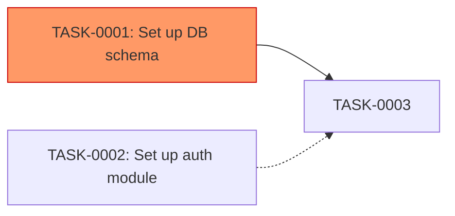

# Task DAG Artifact Schema

**Version:** 1.0.0 | **Last updated:** 2026-07-09 | **Produced by:** `task-dag` (SKL-113)

The `task-dag` skill writes two durable artifacts to the `artifacts/` directory after every full-pipeline run:

| File | Purpose |
|------|---------|
| `artifacts/task-dag-<ISO-timestamp>.json` | Machine-readable DAG: nodes, edges, parallel groups, critical path |
| `artifacts/task-dag-<ISO-timestamp>.md` | Human-readable Mermaid diagram + critical path summary |
| `artifacts/task-dag-latest.json` | Stable symlink → most recent JSON artifact |

---

## ID Formats

| ID Type | Pattern | Example |
|---------|---------|---------|
| Task | `^TASK-\d{4}$` | `TASK-0023` |

---

## JSON Artifact Schema

### Top-level fields

```json
{
  "run_id":        "<UUID v4 — pipeline session_id>",
  "skill":         "task-dag",
  "skill_version": "1.0.0",
  "timestamp":     "<ISO 8601 datetime>",
  "dag_nodes":     [ ... ],
  "dag_edges":     [ ... ],
  "parallel_groups": [ ... ],
  "critical_path": { ... },
  "inference_log": [ ... ]
}
```

### `dag_nodes` array

Each element represents one task:

```json
{
  "task_id":               "TASK-0001",
  "description":           "Set up database schema",
  "level":                 0,
  "is_critical_path":      true,
  "estimated_hours":       4,
  "predecessors":          [],
  "successors":            ["TASK-0003", "TASK-0005"],
  "is_inferred":           false,
  "earliest_start_hours":  0,
  "earliest_finish_hours": 4
}
```

| Field | Type | Description |
|-------|------|-------------|
| `task_id` | string | Task ID in `TASK-NNNN` format |
| `description` | string | Task description (PII-stripped) |
| `level` | integer ≥ 0 | DAG level. Level 0 = entry (no predecessors). |
| `is_critical_path` | boolean | True if this task is on the critical path |
| `estimated_hours` | number | Hours estimated. Default 4 if not provided. |
| `predecessors` | array[string] | Task IDs that must complete before this task |
| `successors` | array[string] | Task IDs that depend on this task |
| `is_inferred` | boolean | True if any predecessor edge was inferred semantically |
| `earliest_start_hours` | number | Earliest possible start (hours from pipeline start) |
| `earliest_finish_hours` | number | Earliest possible finish (start + estimated_hours) |

### `dag_edges` array

```json
[
  { "from": "TASK-0001", "to": "TASK-0003", "is_inferred": false },
  { "from": "TASK-0002", "to": "TASK-0003", "is_inferred": true }
]
```

Direction convention: `from` must complete before `to` starts.

### `parallel_groups` array

```json
[
  { "level": 0, "tasks": ["TASK-0001", "TASK-0002"], "can_run_parallel": true },
  { "level": 1, "tasks": ["TASK-0003"],               "can_run_parallel": true },
  { "level": 2, "tasks": ["TASK-0004", "TASK-0005"], "can_run_parallel": true }
]
```

All tasks within the same level have no dependency between them and can safely run in parallel. The orchestrator presents these groups as parallel execution suggestions.

### `critical_path` object

```json
{
  "task_ids": ["TASK-0001", "TASK-0003", "TASK-0007"],
  "total_duration_hours": 12
}
```

The critical path is the longest-duration chain from any level-0 task to any terminal task (no successors). Reducing the duration of critical-path tasks reduces overall delivery time.

### `inference_log` array

Records edges that were inferred semantically rather than declared explicitly:

```json
[
  {
    "from": "TASK-0005",
    "inferred_dep": "TASK-0001",
    "source": "description_token_scan"
  },
  {
    "from": "TASK-0006",
    "inferred_dep": "TASK-0002",
    "source": "shared_module_and_req"
  }
]
```

| `source` | Meaning |
|----------|---------|
| `description_token_scan` | A `TASK-NNNN` token was found in the task description |
| `shared_module_and_req` | Tasks share both a module reference and a requirement reference |

---

## Markdown Artifact Structure

```
# Task DAG — <session_id>

## Critical Path (total <N>h)
(ordered list: TASK-NNNN — description — <N>h)

## Parallel Groups
| Level | Tasks | Can Parallelize |
...

## Mermaid Diagram


## Inferred Edges
| From | Inferred Dep | Source |
...
```

**Mermaid node styling:**
- Critical path nodes: `fill:#f96,stroke:#c00` (orange-red)
- Parallel-safe entry nodes (level 0): `fill:#9f9,stroke:#090` (green)
- Inferred edges use dashed arrow `-.->` vs solid `-->`

**Diagram truncation:** If `tasks.length > 50`, only the critical path + level 0/1 nodes are shown.
The full DAG is always available in the JSON artifact.

---

## Default Duration

When a task's `estimated_hours` is not provided by `feature-planning`, the DAG skill uses
`4 hours` as the default. This is noted in the artifact header: "Tasks without estimated_hours
use default duration of 4h for critical path calculation."

---

## Integration with Orchestrator

The orchestrator reads `parallel_groups` from the DAG output and presents execution suggestions:

```
Phase 4b complete — Task DAG analysis:
  Critical path: TASK-0001 → TASK-0003 → TASK-0007 (12h total)
  Parallel group 0: TASK-0001, TASK-0002 (can run simultaneously)
  Parallel group 1: TASK-0003 (depends on group 0)
  Parallel group 2: TASK-0004, TASK-0005 (can run simultaneously)
```

These are suggestions only. The team decides which tasks to actually parallelize.

---

## Failure Modes

| Condition | Behavior |
|-----------|----------|
| `tasks[]` empty | Hard error — halt, no artifacts written |
| Dependency cycle detected | Break cycle (inferred first, then lex-last explicit), emit `WARN: cycle_broken`, continue |
| All tasks at level 0 | Single-level DAG, all tasks parallel-safe |
| `tasks.length > 500` | Process first 500 by `task_id`, emit `WARN: tasks_truncated` |
| JSON serialization failure | Retry once; write Markdown only if retry fails |

---

## Full JSON Schema

```json
{
  "$schema": "http://json-schema.org/draft-07/schema#",
  "type": "object",
  "required": ["run_id", "skill", "skill_version", "timestamp",
               "dag_nodes", "dag_edges", "parallel_groups", "critical_path"],
  "properties": {
    "run_id":        { "type": "string", "format": "uuid" },
    "skill":         { "type": "string", "const": "task-dag" },
    "skill_version": { "type": "string" },
    "timestamp":     { "type": "string", "format": "date-time" },
    "dag_nodes": {
      "type": "array",
      "items": {
        "type": "object",
        "required": ["task_id", "level", "is_critical_path", "estimated_hours",
                     "predecessors", "successors", "is_inferred",
                     "earliest_start_hours", "earliest_finish_hours"],
        "properties": {
          "task_id":               { "type": "string", "pattern": "^TASK-\\d{4}$" },
          "description":           { "type": "string" },
          "level":                 { "type": "integer", "minimum": 0 },
          "is_critical_path":      { "type": "boolean" },
          "estimated_hours":       { "type": "number", "minimum": 0 },
          "predecessors":          { "type": "array", "items": { "type": "string" } },
          "successors":            { "type": "array", "items": { "type": "string" } },
          "is_inferred":           { "type": "boolean" },
          "earliest_start_hours":  { "type": "number", "minimum": 0 },
          "earliest_finish_hours": { "type": "number", "minimum": 0 }
        }
      }
    },
    "dag_edges": {
      "type": "array",
      "items": {
        "type": "object",
        "required": ["from", "to", "is_inferred"],
        "properties": {
          "from":        { "type": "string", "pattern": "^TASK-\\d{4}$" },
          "to":          { "type": "string", "pattern": "^TASK-\\d{4}$" },
          "is_inferred": { "type": "boolean" }
        }
      }
    },
    "parallel_groups": {
      "type": "array",
      "items": {
        "type": "object",
        "required": ["level", "tasks", "can_run_parallel"],
        "properties": {
          "level":            { "type": "integer", "minimum": 0 },
          "tasks":            { "type": "array", "items": { "type": "string" } },
          "can_run_parallel": { "type": "boolean", "const": true }
        }
      }
    },
    "critical_path": {
      "type": "object",
      "required": ["task_ids", "total_duration_hours"],
      "properties": {
        "task_ids":             { "type": "array", "items": { "type": "string" } },
        "total_duration_hours": { "type": "number", "minimum": 0 }
      }
    },
    "inference_log": {
      "type": "array",
      "items": {
        "type": "object",
        "properties": {
          "from":         { "type": "string" },
          "inferred_dep": { "type": "string" },
          "source":       { "type": "string", "enum": ["description_token_scan", "shared_module_and_req"] }
        }
      }
    }
  }
}
```

---

**See also:**
- `.opencode/skills/task-dag/SKILL.md` — full execution spec (SKL-113)
- `docs/rtm-schema.md` — RTM artifact schema
- `docs/spec-artifact.md` — spec artifact schema
